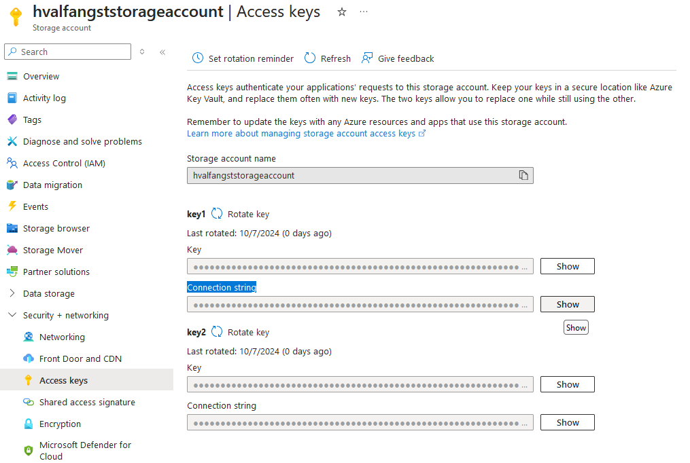
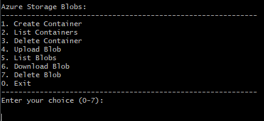

# Azure Blob Storage Python CLI App

A Command Line Interface (CLI) application for managing Azure Blob Storage using the [Azure SDK for Python](https://learn.microsoft.com/en-us/azure/storage/blobs/storage-quickstart-blobs-python?tabs=managed-identity%2Croles-azure-portal%2Csign-in-azure-cli&pivots=blob-storage-quickstart-scratch). 

## Features

- **Create Containers**: Initialize new storage containers.
- **List Containers**: View all existing containers.
- **Delete Containers**: Remove unwanted containers.
- **Upload Blobs**: Add files to containers.
- **List Blobs**: Display all blobs within a container.
- **Download Blobs**: Retrieve blobs to your local machine.
- **Delete Blobs**: Remove blobs from containers.

## Requirements

- **Platform**: x86-64, Linux/WSL
- **Programming Language**: [Python 3](https://www.python.org/downloads/)
- **Terraform**: For provisioning [Azure resources](infra/terraform.tf)
- **Azure Account**: Access to [Azure Subscription](https://azure.microsoft.com/en-us/pricing/purchase-options/azure-account)

## Architecture

The application is structured using the [**Command Pattern**](https://en.wikipedia.org/wiki/Command_pattern), promoting a clean separation of concerns. The key components include:

- **Main Entry Point ([main.py](python/main.py))**: Handles user interaction and delegates commands.
- **Commands Module ([commands.py](python/commands.py))**: Encapsulates each operation as a separate command class.
- **Azure Blob Service Module ([blob_service.py](python/blob_service.py))**: Interfaces directly with Azure Blob Storage via the Azure SDK.
- **Menu Module ([menu.py](python/menu.py))**: Manages the display and interaction of the CLI menu.

## Allocate resources

The script [up](up.sh) provisions Azure resources by applying our [Terraform script](infra/terraform.tf). When resources has been allocated it is paramount that the preliminary value associated with connection string variable defined in our [blob_service.py](python/blob_service.py) is replaced with the **actual** connection string of
your designated storage account. See the below screenshot for where on Azure to retrieve said connection string by clicking on the **show** button for any of the related keys.

## Running application

The script [run](run.sh) starts the event-loop of our CLI application, prompting the following menu for every update cycle:

## Deallocate resources

The script [down](down.sh) removes provisioned Azure resources running **terraform destroy**.
